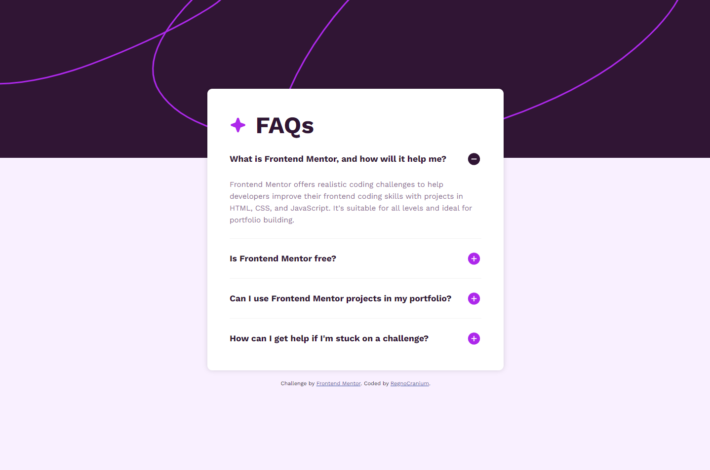
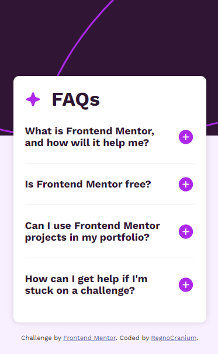

# Frontend Mentor - FAQ accordion solution

This is a solution to the [FAQ accordion challenge on Frontend Mentor](https://www.frontendmentor.io/challenges/faq-accordion-wyfFdeBwBz). Frontend Mentor challenges help you improve your coding skills by building realistic projects.

## Table of contents

- [Overview](#overview)
  - [The challenge](#the-challenge)
  - [Screenshot](#screenshot)
  - [Links](#links)
- [My process](#my-process)
  - [Built with](#built-with)
  - [What I learned](#what-i-learned)
  - [Continued development](#continued-development)
  - [Useful resources](#useful-resources)
- [Author](#author)
- [Acknowledgments](#acknowledgments)
  
## Overview

FAQ accordion

### The challenge

Users should be able to:

- Hide/Show the answer to a question when the question is clicked
- Navigate the questions and hide/show answers using keyboard navigation alone
- View the optimal layout for the interface depending on their device's screen size
- See hover and focus states for all interactive elements on the page

### Screenshot

### Links

- Vercel: [https://faq-accordion-three-cyan.vercel.app](https://faq-accordion-three-cyan.vercel.app)

## My process

### Built with

- Semantic HTML5 markup
- Flexbox
- Mobile-first workflow

### What I learned

Learned about keyboard navigation, event listeners.

### Continued development

Use buttons instead of pseudo-buttons, make better use of CSS and HTML.

### Useful resources

- [ChatGPT](https://chat.openai.com)
- [pseudo-buttons](https://benfrain.com/converting-divs-into-accessible-pseudo-buttons/)

## Author

- Frontend Mentor - [@RegnoCranium](https://www.frontendmentor.io/profile/RegnoCranium)

## Acknowledgments

Thanks to this user's code [@thinotmandresy](https://github.com/thinotmandresy) I finally figured out how to make smooth animation.
